# Ahmedrix Educational Ecosystem — Complete Technical Documentation

## ⚙️ Built From Scratch — No External Dependencies

This application was engineered entirely from the ground up.

Every core component — including architecture design, business logic, real-time communication, and infrastructure handling — was implemented manually as part of this project.

❌ No third-party backend services  
❌ No external APIs  
❌ No plug-and-play platforms  

Everything you see here was designed and developed intentionally to demonstrate system understanding.

---

## 🔐 Admin Demo Credentials

For testing the application, use the following admin account:

```text
Email: aminakazem91@gmail.com
Password: Password100!
```

> ⚠️ This account is provided for demo purposes only. Do not use these credentials in any production environment.

---


---

# 0. Executive Summary

The **Ahmedrix Educational Ecosystem** is a complete learning platform I built from scratch. It lets teachers stream live classes, chat with students, and host one-on-one video sessions — all while keeping data safe and handling thousands of users.

**What makes it special:** I'm the only developer. Every line of code, every container, and every architectural decision reflects a single vision — simplicity without sacrificing power.

The platform handles:
- **Real-time chat** with message history
- **Live video streaming** to thousands of students
- **One-on-one video calls** between teacher and student (private sessions)
- **User management** and course enrollment
- **All of it** running in containers I can restart with one command

---


# Document Control

| Version | Date | Author | Description |
|---------|------|--------|-------------|
| 1.0 | 2026 | Ahmed | Complete system documentation — built and maintained by one developer |

---

# Table of Contents

0. [Executive Summary](#0-executive-summary)
1. [Technical Stack](#1-technical-stack)
2. [Load Balancing & Traffic Orchestration](#2-load-balancing--traffic-orchestration)
3. [Project Structure](#3-project-structure)
5. [System at a Glance](#5-system-at-a-glance)
6. [Architecture Philosophy](#6-architecture-philosophy)
7. [How Everything Connects](#7-how-everything-connects)
8. [Core Modules](#8-core-modules)
9. [Request Flows](#9-request-flows)
10. [How Each Part Works Alone](#10-how-each-part-works-alone)
11. [What Each Component Does](#11-what-each-component-does)
12. [Why This Architecture Works for One Developer](#12-why-this-architecture-works-for-one-developer)
13. [Simple Security Model](#13-simple-security-model)
14. [Deployment](#14-deployment)
15. [Architectural Decisions](#15-architectural-decisions)
16. [Database Schema — ER Diagram & Architecture](#16-database-schema--er-diagram--architecture)
17. [What I'd Tell Another Solo Developer](#17-what-id-tell-another-solo-developer)
18. [Sample Images](#18-sample-images)

---

# 1. Technical Stack

The Ahmedrix Ecosystem is built using a modern, polyglot tech stack to ensure each component handles its specific responsibility with maximum efficiency.

| Component | Technology | Containers | Purpose |
|-----------|------------|------------|---------|
| Core Backend | ASP.NET Core 9 (C#) | 1 | Acting as the Central Data Authority — the only entity that touches the database |
| Database | Microsoft SQL Server | 1 | Primary persistent storage with EF Core as the ORM and automated schema setup |
| Messaging Hub | Redis, WebSockets (Alpine) | 1 | High-speed Pub/Sub messaging for real-time cross-node chat synchronization |
| Standalone Chat | JavaScript & WebSockets | 3 | Distributed nodes (Alpha, Beta, Gamma) designed for high-concurrency messaging |
| Media Servers | Node Media Server | 3 | Scalable cluster for RTMP/HLS ingestion and mass broadcasting to viewers |
| Video Bridge | Node.js | 1 | Managing internal signaling and media bridging between streaming services |
| Load Balancing | HAProxy | 2 | Traffic distribution and high availability (Active Health Checks) for chat and video |
| Real-Time Media | WebRTC API | 1 | Low-latency Peer-to-Peer one-on-one sessions between teacher and student |
| Infrastructure | Docker & Docker Compose | Total: 13 | Full-system containerization — one command to start the entire ecosystem |

---

# 2. Load Balancing & Traffic Orchestration

The system uses multiple Load Balancing layers to prevent bottlenecks and ensure 99.9% uptime. Each layer is designed for its specific job.

## 2.1 Chat Service Load Balancer

**Handles:** WebSocket connections for real-time messaging

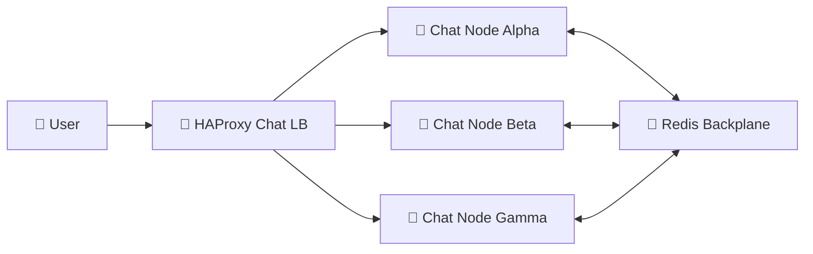

**How it works:**
- Client connects → HAProxy assigns them to a specific chat node
- **Sticky Sessions (IP Hash)** ensure the client stays connected to the same node
- If the person they're messaging is on a different node, **Redis Backplane** routes the message across the cluster
- All messages are saved to the .NET API for persistence

**Why this matters:** Users stay connected to the same server, but Redis ensures everyone sees all messages anyway.

## 2.2 Video Streaming Load Balancer

**Handles:** RTMP ingest (teacher streaming) and playback (students watching)

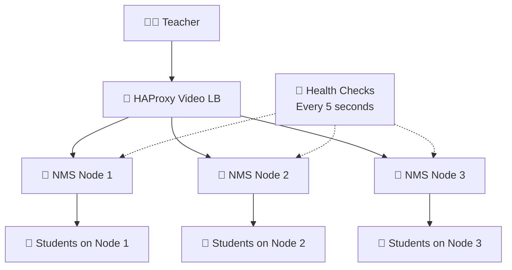

**How it works:**
- Teacher streams → HAProxy sends them to the least busy NMS node
- Students connect → HAProxy sends them to the node with lowest CPU/bandwidth usage
- **Active Health Checks** run every 5 seconds
- If a node fails → Traffic reroutes to healthy nodes in milliseconds

**Why this matters:** Students always get the best available server. If a server dies, they barely notice the switch.

## 2.3 Load Balancer Summary

| Load Balancer | Type | Strategy | What It Handles |
|---------------|------|----------|-----------------|
| **Chat LB** | HAProxy | Sticky Sessions (IP Hash) | WebSocket connections, chat messages |
| **Video LB** | HAProxy | Least Connections | RTMP ingest, HLS playback |

**Why this matters for a solo developer:** Each load balancer is simple, focused, and does one job well. If something breaks, I know exactly which piece to look at. No magic, no mystery — just solid engineering I can maintain alone.

---

# 3. Project Structure

```text
Ahmedrix-Educational-Platform-Ecosystem/
│
├── 🎯 Core Platform (ASP.NET Core 9 MVC)
│   ├── Controllers/            → REST API endpoints
│   ├── Entities/               → Domain models
│   ├── Services/               → Business logic layer
│   ├── Areas/                  → Different Areas within the app (admin, identity..etc)
│   └── Dockerfile              → Core API container
│
├── 💬 Chat Microservice (Node.js + Socket.io)
│   └── my-secret-chat/
│       ├── index.js            → Main chat server
│       ├── Client_Side.js      → Client-side socket logic
│       ├── database/           → Message storage
│       ├── haproxy-chat.cfg    → Chat load balancer config
│       └── Dockerfile          → Chat container
│
├── 📺 Video Streaming Cluster (Node Media Server)
│   └── Vedio Streaming servers/
│       ├── server1/            → NMS instance 1
│       ├── server2/            → NMS instance 2
│       ├── server3/            → NMS instance 3
│       ├── haproxy/            → Video load balancer config
│       └── dashboard.html      → Streaming dashboard
│
├── 📞 WebRTC Platform (One-to-One Video)
│   └── WebRTC Vedio Platfrom/
│       ├── server.js           → Signaling server
│       ├── index.html          → Client interface
│       ├── js/                 → Frontend logic
│       ├── www/CSS/            → Styling
│       └── Dockerfile          → WebRTC container
│
└── 🐳 Infrastructure
    ├── .dockerignore           → Docker exclusions
    ├── .gitignore           → Git exclusions
    ├── docker-compose.yml  → Full system orchestration
    └── database/               → SQL Server files (.mdf, .ldf)
   
```


# 5. System at a Glance

```
┌─────────────────────────────────────────────────────────────┐
│                    WHAT I BUILT                              │
├─────────────────────────────────────────────────────────────┤
│                                                              │
│  🎯 One .NET API that controls everything                    │
│  💬 Three chat servers so messages never lag                 │
│  📺 Three video servers so thousands can watch               │
│  🤝 One signaling server for one-on-one video calls          │
│  📨 Redis to help chat servers talk to each other            │
│  🚦 Traffic cops (HAProxy) so no server gets too busy        │
│  🗄️ SQL Server that only the API talks to                     │
│                                                              │
│  All running in Docker containers — start everything with:   │
│  > docker-compose up                                         │
│                                                              │
└─────────────────────────────────────────────────────────────┘
```

---

# 6. Architecture Philosophy

**"Centralize control, distribute the work, keep it simple."**

| Principle | What It Means |
|-----------|---------------|
| **Single Source of Truth** | Only the .NET API writes to the database. Everyone else asks the API. |
| **Stateless Workers** | Chat and video servers can crash. Just restart them — no data lost. |
| **Horizontal Scaling** | More users? Add more chat servers. Add more video servers. Done. |
| **Infrastructure as Code** | Everything is in Docker. One file describes the whole system. |
| **Loose Coupling** | If chat breaks, video still works. If video breaks, chat still works. |

---

# 7. How Everything Connects

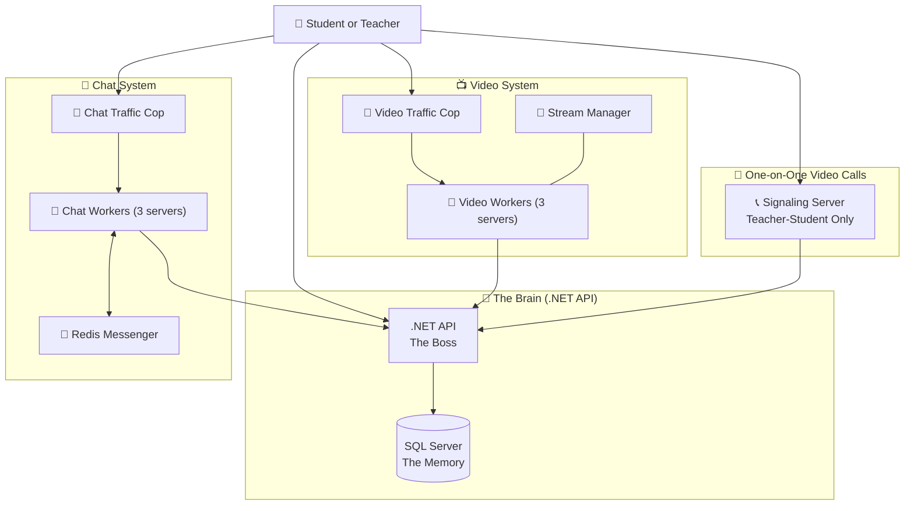

**Simple explanation:**
- The **.NET API** is the boss — only it talks to the database
- **Chat workers** handle messages but ask the boss to save them
- **Video workers** stream to students but check with the boss who can watch
- **Redis** helps chat workers talk to each other
- **Traffic cops** make sure no worker gets overwhelmed
- **WebRTC server** helps set up one-on-one calls between teacher and student only

---

# 8. Core Modules

## 8.1 The .NET MVC — The Brain

This is the most important part. Everything goes through here.

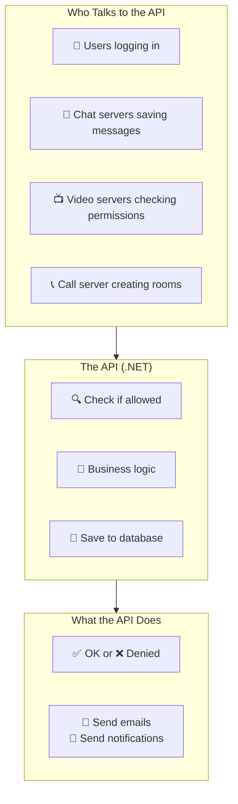

**What it does:**
- Checks if users are allowed to do things
- Saves everything to the database
- Sends emails when people sign up
- Is the **only** thing that touches the database

## 8.2 The Chat System

Three chat servers working together so messages never get lost.

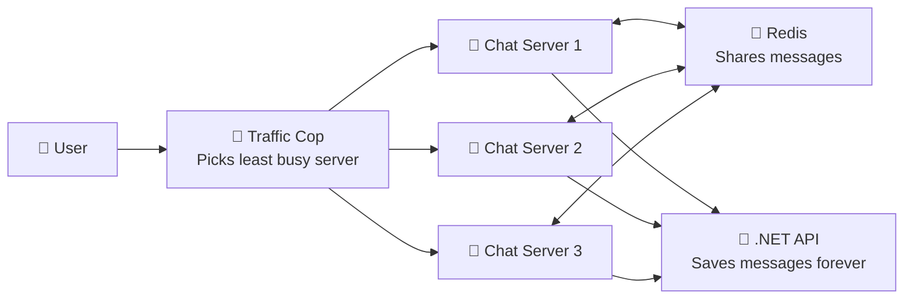

**Why three servers?** If one crashes, chat keeps working. If we get more users, I can add more servers.

**Why Redis?** So users on Server 1 can talk to users on Server 3. Redis shares messages between all servers instantly.

## 8.3 The Video Streaming System

Three video servers so thousands of students can watch at once.

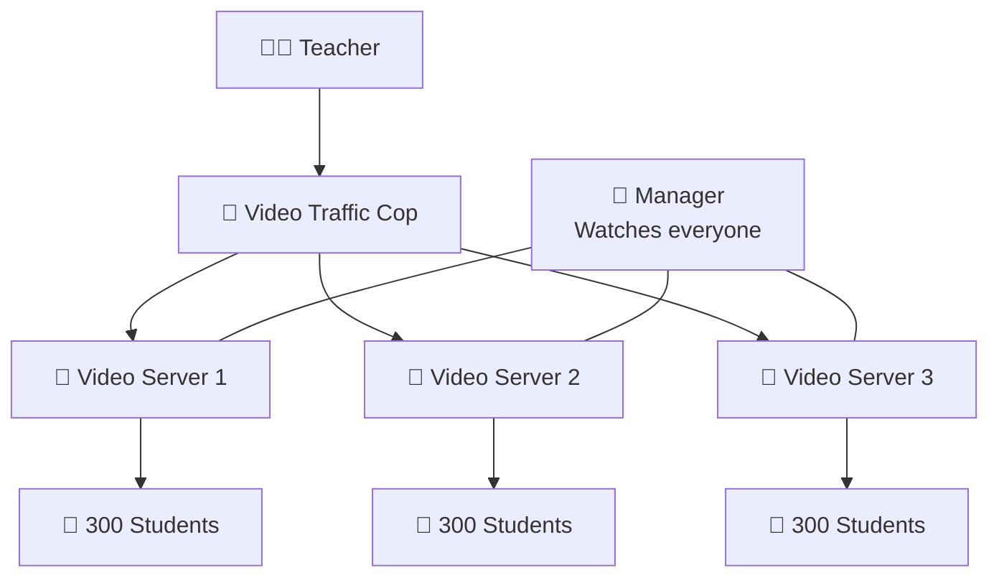

**Why three servers?** Each server can handle about 300 students. Three servers = 900 students. Need more? Add more servers.

**What's the Bridge?** It watches all servers and helps balance the load. If one server gets too busy, the Bridge can send new streams to others.

## 8.4 The WebRTC System — One-on-One Video

For private one-on-one video calls between a teacher and a student. No groups, no extra participants — just teacher and student.

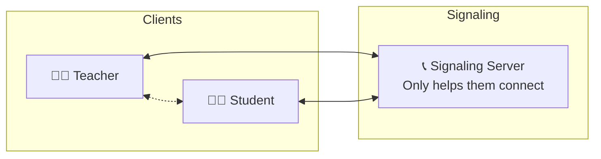

**How it works:**
1. Teacher requests a private session with a specific student
2. The signaling server helps them find each other
3. Once connected, video goes directly between them — no server needed
4. **No third person can join** — it's strictly one-on-one

**Why one-on-one only?** This is for private tutoring, office hours, and personal consultations. No group calls, no classrooms — just teacher and student.

---

# 9. Request Flows

## 9.1 What Happens When a Teacher Starts Streaming

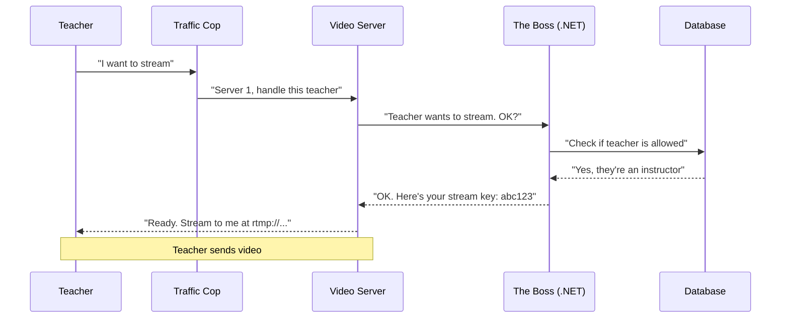

## 9.2 What Happens When a Student Watches

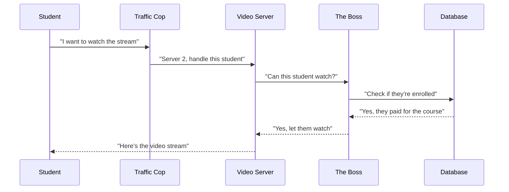

## 9.3 What Happens When Students Chat

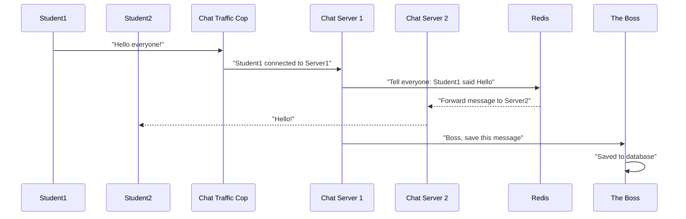

## 9.4 What Happens During a One-on-One Video Call

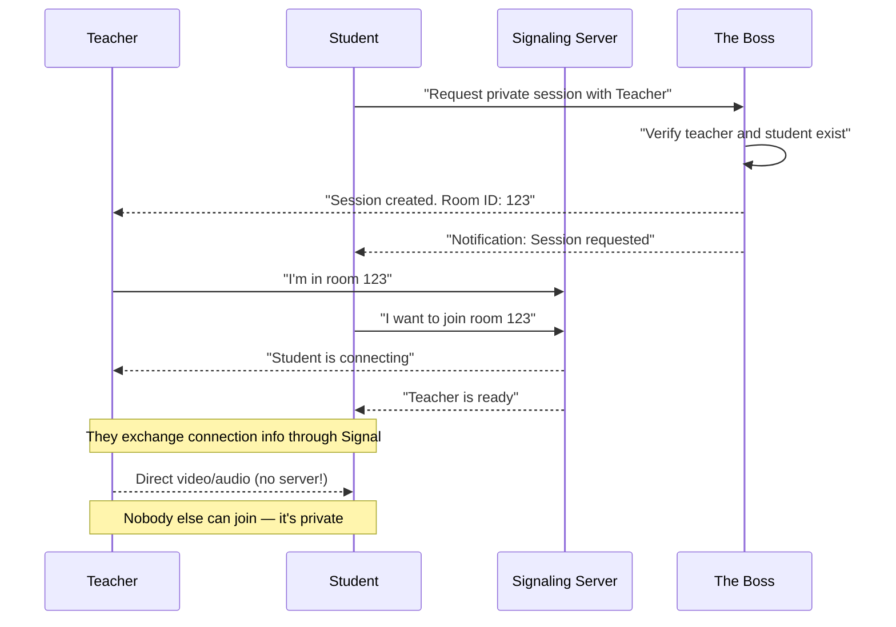

---

# 10. How Each Part Works Alone

## 10.1 Chat System — Simple View

```
                    ┌─────────────────┐
                    │   🚦 TRAFFIC COP  │
                    │   (HAProxy)       │
                    └────────┬────────┘
              ┌──────────────┼──────────────┐
              ▼              ▼              ▼
        ┌──────────┐  ┌──────────┐  ┌──────────┐
        │ 💭 Server1│  │ 💭 Server2│  │ 💭 Server3│
        │ (Alpha)  │  │ (Beta)   │  │ (Gamma)  │
        └────┬─────┘  └────┬─────┘  └────┬─────┘
             └──────────────┼──────────────┘
                            ▼
                    ┌──────────────┐
                    │   📨 REDIS    │
                    │   (Messenger) │
                    └──────────────┘
```

## 10.2 Video System — Simple View

```
                    ┌─────────────────┐
                    │   🚦 TRAFFIC COP  │
                    │   (HAProxy)       │
                    └────────┬────────┘
              ┌──────────────┼──────────────┐
              ▼              ▼              ▼
        ┌──────────┐  ┌──────────┐  ┌──────────┐
        │ 📺 Server1│  │ 📺 Server2│  │ 📺 Server3│
        │          │  │          │  │          │
        └────┬─────┘  └────┬─────┘  └────┬─────┘
             │             │             │
        ┌────▼────┐   ┌────▼────┐   ┌────▼────┐
        │ 300     │   │ 300     │   │ 300     │
        │ Students│   │ Students│   │ Students│
        └─────────┘   └─────────┘   └─────────┘
```

## 10.3 The .NET API — The Boss

```
                    ┌─────────────────────────┐
                    │    WHO TALKS TO THE BOSS   │
                    └─────────────────────────┘
                           ▼           ▼
              ┌──────────────────────────────┐
              │         THE BOSS              │
              │      (.NET API)               │
              │  "I decide who gets what"     │
              └──────────────────────────────┘
                    ▼           ▼           ▼
        ┌──────────────┐  ┌──────────────┐  ┌──────────────┐
        │  ✅ ALLOW    │  │  ❌ DENY     │  │  📧 SEND     │
        │  Access      │  │  Access      │  │  Email       │
        └──────────────┘  └──────────────┘  └──────────────┘
                           ▼
                    ┌──────────────┐
                    │    🗄️ DATABASE │
                    │  (SQL Server) │
                    └──────────────┘
```

## 10.4 WebRTC System — One-on-One View

```
                    ┌─────────────────┐
                    │   THE BOSS (.NET) │
                    │  Creates rooms,  │
                    │  verifies users  │
                    └────────┬────────┘
                             │
                    ┌────────▼────────┐
                    │  SIGNALING SERVER │
                    │  Helps them find  │
                    │    each other     │
                    └────────┬────────┘
              ┌──────────────┼──────────────┐
              ▼                             ▼
        ┌──────────┐                   ┌──────────┐
        │ TEACHER  │◄─── Direct Video ──►│ STUDENT  │
        │          │       (P2P)        │          │
        └──────────┘                   └──────────┘
        
        ⚠️ NO THIRD PERSON CAN JOIN ⚠️
```

---

# 11. What Each Component Does

| Component | What It Does | Why I Built It This Way |
|-----------|--------------|------------------------|
| **.NET API** | The only thing that touches the database. Checks permissions, saves data, handles logic. | One source of truth = no data corruption. If I need to fix something, I know exactly where to look. |
| **SQL Server** | Stores everything — users, courses, messages, stream records | Reliable. I've used it before. It doesn't lose data. |
| **Chat Servers (x3)** | Handle live messaging. Three of them so they don't get overwhelmed. | If one crashes, chat still works. Students don't even notice. |
| **Redis** | Shares messages between chat servers | Without it, users on different servers couldn't chat with each other. |
| **Chat Load Balancer** | Decides which chat server handles each user | Prevents any single server from getting too busy and slowing down. |
| **Video Servers (x3)** | Receive streams from teachers, send to students | More servers = more students can watch at the same time. |
| **Video Load Balancer** | Sends students to the least busy video server | Smooth playback for everyone. No buffering because one server is overloaded. |
| **Video Bridge** | Watches all video servers, helps manage streams | Like a supervisor making sure no server is struggling. |
| **WebRTC Server** | Just helps teachers and students find each other for one-on-one video calls | Actual video goes directly between them — saves my server bandwidth. **Strictly one-on-one — no groups.** |

---

# 12. Why This Architecture Works for One Developer

**I can fix anything** because I built everything. When something breaks at 2 AM, I know exactly where to look.

**I can scale what needs scaling** without touching the core. More chat users? Add another chat server. More viewers? Add another video server. The API doesn't care.

**I can sleep at night** knowing if one part fails, the rest keeps working. Chat can crash but video keeps streaming. Video server can die but chat keeps working.

**I can add features** without breaking existing ones. New feature? It just talks to the API like everything else.

**I can deploy everything** with one command: `docker-compose up`

**What I gave up for simplicity:**
- No Kubernetes (too complex for one person to manage)
- No microservice mesh (would take months to debug)
- No service discovery (Docker networks are good enough)
- No group video calls (WebRTC is strictly one-on-one for simplicity)
- **But it works, it's fast, and I can maintain it alone**

---

# 13. Simple Security Model

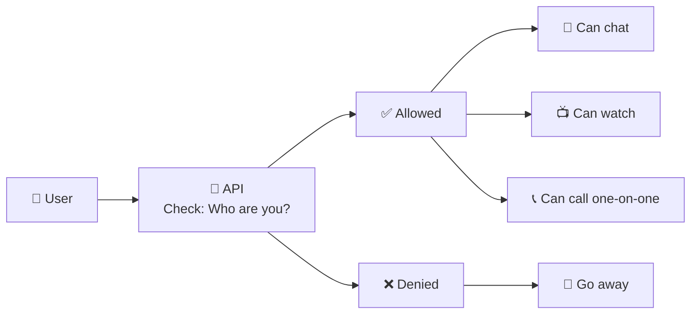

**The rule:** Nobody does anything important without checking with the API first. The API decides who gets to do what.

**Why this is enough:** All the chat servers and video servers do is pass data around. They don't make decisions. The API makes all the decisions. So even if a chat server gets hacked, it can't do much damage — it still has to ask the API for anything important.

**For one-on-one video:** The API creates the room and verifies both participants. The signaling server just helps them connect. Once connected, they talk directly — no way for a third person to join.

---

# 14. Deployment

```bash
# Start everything
docker-compose up --build


or
docker-compose up -d


# See what's happening
docker-compose logs -f


# Stop everything
docker-compose down


⚠️ Important: Database Attachment (First-Time Setup)

After starting the containers for the first time, you must manually execute the following command to attach the .mdf and .ldf files to the SQL Server instance:
Bash

docker exec -it sql_server_container /opt/mssql-tools18/bin/sqlcmd -S localhost -U sa -P YourPass@8888 -C -i /var/opt/mssql/backup/setup.sql

Technical Notes:

    Credentials: This command uses the default system administrator (sa) password defined in the docker-compose.yml file (YourPass@8888 ).

    Timing: Run this command only after the SQL container status shows as Healthy (usually takes 30-60 seconds after the first boot).

    Persistence: You only need to run this once. The database will remain attached even if you stop and restart the containers.

    Configuration: If you modify the MSSQL_SA_PASSWORD in your environment variables, ensure you update it in this command as well.

```


Everything is in containers. If something breaks, I just restart that container. No reinstalling. No configuration drift. No "it works on my machine."

**The network:** All containers live in `chat_network` — a private Docker network. They can talk to each other, but nothing from outside can poke around unless I explicitly open a port.

---

# 15. Architectural Decisions

## Decision 1: One API to Rule Them All
**The problem:** I need multiple services but data must stay consistent.
**My solution:** Only the .NET API writes to the database.
**Why:** One source of truth eliminates data corruption.

## Decision 2: Multiple Chat Servers
**The problem:** One chat server can handle only so many connections.
**My solution:** Three chat servers with a load balancer.
**Why:** If one crashes, two still work. Redis keeps them in sync.

## Decision 3: Multiple Video Servers
**The problem:** Video streaming is CPU-heavy.
**My solution:** Three video servers with load balancing.
**Why:** Each server handles its share. 3 servers = 3x the viewers.

## Decision 4: Redis for Chat Sync
**The problem:** Users on different servers can't see each other's messages.
**My solution:** Redis Pub/Sub.
**Why:** Simple. Fast. Works.

## Decision 5: WebRTC for One-on-One Video Calls
**The problem:** Server-based video calling costs too much bandwidth.
**My solution:** WebRTC with strict one-on-one only.
**Why:** Direct peer-to-peer video. No server bandwidth used.

## Decision 6: Docker for Everything
**The problem:** Manual server setup is error-prone.
**My solution:** Everything in Docker.
**Why:** One command to start. Works the same everywhere.

---

# 16. Database Schema — ER Diagram & Architecture

## Overview

The database is the single source of truth for the entire Ahmedrix ecosystem. Only the .NET API writes to it. All other services (chat, video, WebRTC) read through the API or cache.

## Schema Diagram

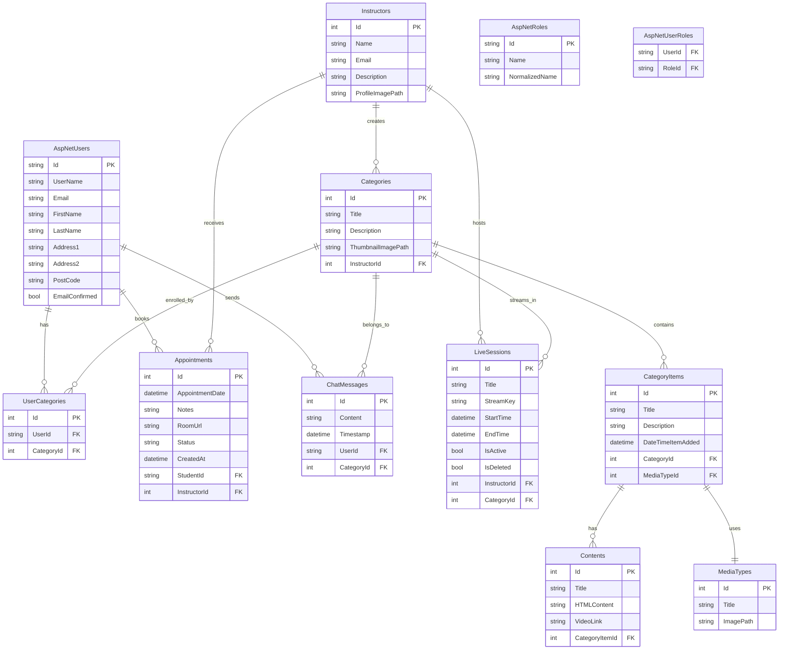

## Core Tables Explained

| Table | Purpose | Key Relationships |
|-------|---------|-------------------|
| **AspNetUsers** | User accounts (students) | Links to enrollments, messages, appointments |
| **Instructors** | Teacher profiles | Owns categories and live sessions |
| **Categories** | Courses/classes | Container for learning materials |
| **CategoryItems** | Modules within a course | Links to actual content |
| **Contents** | The actual lesson material | HTML, video links |
| **LiveSessions** | Active/recorded streams | Tracks stream keys and status |
| **ChatMessages** | Course chat history | Persisted from Redis |
| **Appointments** | One-on-one video sessions | Stores room URLs and status |
| **UserCategories** | Many-to-many: users enrolled in courses | Junction table |

## Key Design Decisions

**Single Source of Truth**
Only the .NET API writes to these tables. Chat servers, video servers, and WebRTC all sync through the API.

**Identity Integration**
AspNetUsers, AspNetRoles, AspNetUserRoles come from ASP.NET Core Identity — handles authentication out of the box.

**Soft Deletes**
LiveSessions uses `IsDeleted` flag instead of hard deletion. History is preserved.

**Audit Fields**
CreatedAt, StartTime, EndTime, Timestamp fields track when things happen.

**Room URLs**
Appointments stores WebRTC room URLs for one-on-one sessions — created by API, used by signaling server.

## Data Flow Through the System

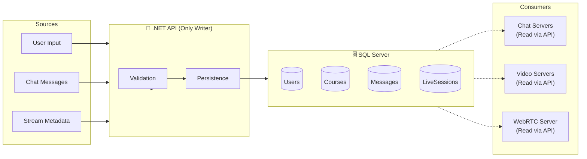

## File Structure

The database files are mounted as volumes in Docker:

```
/database/
├── aspnet-OnlineCoursesPlatform.mdf      # Primary data file (73 MB)
└── aspnet-OnlineCoursesPlatform_log.ldf  # Transaction log (8 MB)
```

These files persist even when containers are destroyed — data survives restarts.

---

# 17. What I'd Tell Another Solo Developer

**If you're building something alone:**

1. **Make the core rock solid** — One API, one database. This is your source of truth. Don't let anything else touch it.

2. **Make the edge services disposable** — Chat servers, video servers — they can crash. Just restart them. No data lost.

3. **Use Redis to connect things** — It's simpler than building direct connections between services.

4. **Load balancers are your friend** — They prevent outages and make scaling easy.

5. **Document as you go** — This document is my memory. Six months from now, I'll thank myself.

6. **Accept trade-offs** — I don't have Kubernetes. I don't have service mesh. I don't have group video calls. But I have a system I can maintain alone, and it works.

---

# 18. Sample Images


---

> **Note:** An AI Agent is currently under development and will be integrated into the ecosystem soon.

---

*— Ahmed, Solo Architect & Developer*

*Built from scratch. Maintained by one person. Ready for thousands.*
